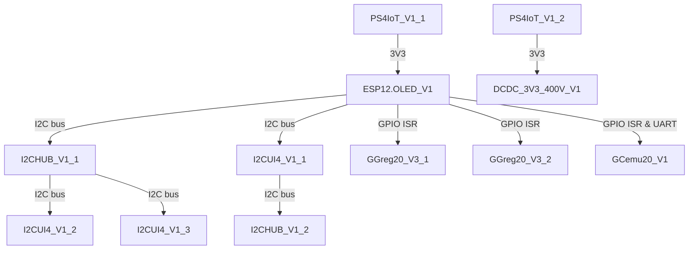

# IoT-devices LLC News and Logs
In this repository you will find news and changelog of our projects. This data is also available on our [website](https://iot-devices.com.ua/en/) and on [Hackaday](https://hackaday.io/iotdevicesdev) or [Twitter](https://twitter.com/iotdevicescomua) or [AllMyLinks](https://allmylinks.com/iot-devices), but for convenience, we decided to post it here as well, so that everyone can read our news posts without leaving GitHub.

Best Regards,

IoT-devices Team

___

# IF BlackFriday() OR CyberMonday() THEN Sale(%);
Cyber Monday until 30.11!

We launch “Cyber Monday” 2023 campaign from 24.11 to 30.11 and set **10% discount when buying any of our modules** on [iot-devices.com.ua](https://iot-devices.com.ua/en) and [Tindie](https://www.tindie.com/stores/iotdev/) and [Etsy](https://iotdevicesllc.etsy.com) trading platforms.

Pay attention to our new charity product [GGreg20_ES](https://go.iot-devices.com.ua/ggreg20_es)

As well as our popular modules:

GGreg20_V3 radioactive particle detector with J305 Geiger tube: ggreg20_v3 
DCDC_3V3_400V_V1 module is a high voltage 3.3V DC to 400V converter: dcdc_3v3_400v_v1.
I2CUI4_V1 User Interface – I2C module with 5-button keypad: i2cui4_v1

Source:
https://iot-devices.com.ua/en/cyber-monday-promotion-till-30-11-en/

# Easy Links
Note: the nodes in the diagram are links that can be opened by right-clicking.

Product links that are easy to remember:

| IoT Module | Description | Easy Link |
| -- | ------ | --------- |
| [ESP12.OLED_V1](https://iot-devices.com.ua/en/product/esp12oled-universal-esp8266-mcuboard-oled-en/) | Universal ESP8266 MCU board with 0.96″ I2C 128×64 OLED and RGB LED | [go.iot-devices.com.ua/esp8266-mcu-board](https://go.iot-devices.com.ua/esp8266-mcu-board) |
| [I2CUI4_V1](https://iot-devices.com.ua/en/product/i2cui4v1-user-interface-i2c-module-with-5keys-keypad-rgb-led-buzzer/) | MCP23017 I2C user interface 5-key keypad module with RGB LED and Buzzer and GPIOs | [go.iot-devices.com.ua/i2c-keypad](https://go.iot-devices.com.ua/i2c-keypad) |
| [GGreg20_V3](https://iot-devices.com.ua/en/product/ggreg20_v3-ionizing-radiation-detector-with-geiger-tube-sbm-20/) | Geiger counter radiation detector with pulsed output | [go.iot-devices.com.ua/geiger-counter](https://go.iot-devices.com.ua/geiger-counter) |
| [GCemu20_V1](https://iot-devices.com.ua/en/product/gcemu20_v1-geiger-counter-emulator/) | Geiger counter emulator | [go.iot-devices.com.ua/geiger-counter-emulator](https://go.iot-devices.com.ua/geiger-counter-emulator) |
| [GGreg20_ES](https://iot-devices.com.ua/en/product/ggreg20-geiger-counter-epoxy-souvenir/) | Epoxy souvenir Geiger counter | [go.iot-devices.com.ua/souvenir-geiger-counter](https://go.iot-devices.com.ua/souvenir-geiger-counter) |
| [DCDC_3V3_400V_V1](https://iot-devices.com.ua/en/product/peretvoruvach-naprugy-postijnogo-strumu-dcdc_3v3_400v_v1-3-3-vv-naprugu-400-v-dlya-zhyvlennya-trubky-gejgera-myullera/) | High voltage converter | [go.iot-devices.com.ua/high-voltage-converter](https://go.iot-devices.com.ua/high-voltage-converter) |
| [I2CHUB_V1](https://iot-devices.com.ua/en/product/i2chub-v1-module-i2c-bus-interfaces-splitter/) | I2C bus interface splitter | [go.iot-devices.com.ua/i2c-hub](https://go.iot-devices.com.ua/i2c-hub) |
| [PS4IoT_V1](https://iot-devices.com.ua/en/product/ps4iot-smart-power-module/) | Smart power supply unit for IoT projects (*discontinued*) | [go.iot-devices.com.ua/smart-power-supply](https://go.iot-devices.com.ua/smart-power-supply) |

View the full list of easy links on our [website](https://iot-devices.com.ua/easy-links/).

## Availability by marketplace

| Product | Website | Tindie | Etsy |
| -- | ------ | --------- | ------ |
| [ESP12.OLED_V1](https://iot-devices.com.ua/en/product/esp12oled-universal-esp8266-mcuboard-oled-en/) | [Link](https://go.iot-devices.com.ua/esp12_oled_v1) | [Link](https://go.iot-devices.com.ua/esp12_oled_v1_tindie) | |
| [I2CUI4_V1](https://iot-devices.com.ua/en/product/i2cui4v1-user-interface-i2c-module-with-5keys-keypad-rgb-led-buzzer/) | [Link](https://go.iot-devices.com.ua/i2cui4_v1) | [Link](https://go.iot-devices.com.ua/i2cui4_v1_tindie) | |
| [GGreg20_V3](https://iot-devices.com.ua/en/product/ggreg20_v3-ionizing-radiation-detector-with-geiger-tube-sbm-20/) | [Link](https://go.iot-devices.com.ua/ggreg20_v3) | [Link](https://go.iot-devices.com.ua/ggreg20_v3_tindie) | [Link](https://go.iot-devices.com.ua/ggreg20_v3_etsy) |
| [GCemu20_V1](https://iot-devices.com.ua/en/product/gcemu20_v1-geiger-counter-emulator/) | [Link](https://go.iot-devices.com.ua/gcemu20_v1) | [Link](https://go.iot-devices.com.ua/gcemu20_v1_tindie) | |
| [GGreg20_ES](https://iot-devices.com.ua/en/product/ggreg20-geiger-counter-epoxy-souvenir/) | [Link](https://go.iot-devices.com.ua/ggreg20_es) | [Link](https://go.iot-devices.com.ua/ggreg20_es_tindie) | [Link](https://go.iot-devices.com.ua/ggreg20_es_etsy) |
| [DCDC_3V3_400V_V1](https://iot-devices.com.ua/en/product/peretvoruvach-naprugy-postijnogo-strumu-dcdc_3v3_400v_v1-3-3-vv-naprugu-400-v-dlya-zhyvlennya-trubky-gejgera-myullera/) | [Link](https://go.iot-devices.com.ua/dcdc_3v3_400v_v1) | [Link](https://go.iot-devices.com.ua/dcdc_3v3_400v_v1_tindie) | |
| [I2CHUB_V1](https://iot-devices.com.ua/en/product/i2chub-v1-module-i2c-bus-interfaces-splitter/) | [Link](https://go.iot-devices.com.ua/i2chub_v1) | [Link](https://go.iot-devices.com.ua/i2chub_v1_tindie) |  |
| [PS4IoT_V1](https://iot-devices.com.ua/en/product/ps4iot-smart-power-module/) | *discontinued* | - | - |

## 28.10.2023
### [EN: GGreg20_ES – souvenir Geiger counter](https://iot-devices.com.ua/en/ggreg20-geiger-counter-epoxy-souvenir/)
#### [GGreg20_ES – сувенірний лічильник Гейгера](https://iot-devices.com.ua/ggreg20_v3-esp12-oled_v1-kpi-project/)

>As participants in the DIY IoT market, we see that the same faulty or exhausted SBM-20 Geiger tubes are resold from hand to hand several times, because no one wants to lose potential profits...

## 16.08.2023
### [EN: GGreg20_V3 and ESP12.OLED_V1 in the project of KPI specialists](https://iot-devices.com.ua/en/ggreg20_v3-esp12-oled_v1-kpi-project/)
#### [GGreg20_V3 та ESP12.OLED_V1 у проєкті фахівців КПІ](https://iot-devices.com.ua/ggreg20_v3-esp12-oled_v1-kpi-project/)

>An interesting work by experts from the Kyiv Polytechnic Institute describes software methods for analyzing streaming data, in particular, for analyzing radiation pollution...

## 18.07.2023
### [EN: Our modules Radioactive particle detector GGreg20 on the GMCmap service map](https://iot-devices.com.ua/en/our-modules-ggreg20_v3-radioactive-particle-detector-on-the-gmcmap-com-service-map-en/)
#### [Наші модулі Детектор радіоактивних частинок GGreg20 на карті сервісу GMCmap](https://iot-devices.com.ua/our-modules-ggreg20_v3-radioactive-particle-detector-on-the-gmcmap-com-service-map/)

>Great news! Several more customers have connected to the gmcmap.com radiation detectors based on our GGreg20 radioactive particle detector module...

## 17.07.2023
### [EN: GGreg20_V3 with Raspberry Pi Pico W under Home Assistant with ESPHome firmware config example](https://iot-devices.com.ua/en/ggreg20_v3-with-raspberry-pi-pico-w-under-home-assistant-with-esphome-firmware-config-example-en/)
#### [Приклад налаштування GGreg20_V3 на Raspberry Pi Pico W у Home Assistant з прошивкою ESPHome](https://iot-devices.com.ua/ggreg20_v3-with-raspberry-pi-pico-w-under-home-assistant-with-esphome-firmware-config-example/)

>We’ve been planning to post a GGreg20_V3 configuration example for the Raspberry Pi Pico W since ESPHome started supporting this wonderful controller with wireless support. But after users started making projects for RPi with GGreg20_V3, and after Tom’s Hardware wrote about a project using Pico W...

## 24.05.2023
### [EN: Product Repo - DIY Geiger Counter Module GGreg20_V3](https://github.com/iotdevicesdev/DIY-Geiger-Counter-Module-GGreg20_V3)

>We have created a "root" repository for the Geiger counter module GGreg20_V3. This is a special place where we will post and keep up-to-date all about this product....

## 5.05.2023
### [EN: Geiger-Muller tubes: Comparison of SBM20, J305 and LND712](https://iot-devices.com.ua/en/comparison-of-geiger-muller-tubes-sbm20-j305-and-lnd712/)
#### [Трубки Гейгера-Мюллера: порівняння SBM20, J305 та LND712](https://iot-devices.com.ua/comparison-of-geiger-muller-tubes-sbm20-j305-and-lnd712/)

>We understand very well the difficulties of choosing for radio amateurs who have to choose between different options, including tubes, when ordering a product. When we developed GGreg20 in 2020, we did not know anything about these things at all. Now we can share our company’s experience with anyone who needs help or is just looking for more information...

## 12.04.2023
### [EN: Technical note: How to calculate the conversion factor for Geiger tube SBM20](https://iot-devices.com.ua/en/technical-note-how-to-calculate-the-conversion-factor-for-geiger-tube-sbm20/)
#### [Технічна нотатка: Як розрахувати коефіцієнт перетворення для трубки Гейгера СБМ20](https://iot-devices.com.ua/technical-note-how-to-calculate-the-conversion-factor-for-geiger-tube-sbm20/)

>The main goal of this publication is to correctly calculate and, if possible, understand where the conversion factors such as 8.77 and 0.0057 for the SBM20 tube, which are all published on the Internet, come from....

## 11.04.2023
### [EN: UV test of Geiger tubes J305](https://iot-devices.com.ua/en/uv-test-of-the-j305-geiger-tubes/)
#### [УФ тест трубок Гейгера J305](https://iot-devices.com.ua/uv-test-of-the-j305-geiger-tubes/)

>There are videos on the Internet showing that J305 tubes are very sensitive to UV rays. They literally go crazy under the influence of this type of radiation. We conducted our own quick UV test of Geiger tubes J305...

## 1.04.2023
### [EN: Technical note: Geiger counter at low temperatures – the work of a DIY module](https://iot-devices.com.ua/en/technical_note_performance_of_diy_geiger_counter_ggreg20_v3_at_low_-temperatures/)
#### [Технічна нотатка: Лічильник Гейгера при низьких температурах – робота DIY модуля](https://iot-devices.com.ua/technical_note_performance_of_diy_geiger_counter_ggreg20_v3_at_low_-temperatures_ua/)

>We wondered what would happen if we took our DIY Geiger counter module GGreg20_V3 and put it in a freezer with a target temperature of -23 Celsius together with the ESP32 controller. Will our sensor work at such a low temperature? Will we see any failures or deviations in the radiation sensor measurements?...

## 31.03.2023
### [EN: Geiger counter emulator of GGreg20_V3 module by means of ESP8266 Part 3: Testing and Conclusion](https://iot-devices.com.ua/en/geiger-counter-emulator-ggreg20_v3-module-by-means-of-esp8266-part3/)
#### [Емулятор лічильника Гейгера GGreg20_V3 засобами ESP8266 Частина 3: Тестування та висновок](https://iot-devices.com.ua/geiger-counter-emulator-ggreg20_v3-module-by-means-of-esp8266-part3-ua/)

>After we’ve built the emulator and programmed the ESP8266, we can test it to make sure it’s working correctly....

## 29.03.2023
### [EN: Geiger counter emulator of GGreg20_V3 module by means of ESP8266 Part 2 Building the Emulator](https://iot-devices.com.ua/en/geiger-counter-emulator-ggreg20_v3-module-by-means-of-esp8266-part2/)
#### [Емулятор лічильника Гейгера GGreg20_V3 засобами ESP8266: Частина 2 Створення емулятора](https://iot-devices.com.ua/geiger-counter-emulator-ggreg20_v3-module-by-means-of-esp8266-part2-ua/)

>Welcome to the second part of our tutorial on building a hardware-software Geiger counter emulator module based on ESP8266. This emulator can be useful for testing and tuning Geiger counters or for educational purposes. Let’s get started!...

## 27.03.2023
### [EN: Geiger counter emulator of GGreg20_V3 module by means of ESP8266](https://iot-devices.com.ua/en/geiger-counter-emulator-ggreg20_v3-module-by-means-of-esp8266-part1/)
#### [UA: Емулятор лічильника Гейгера GGreg20_V3 засобами ESP8266](https://iot-devices.com.ua/geiger-counter-emulator-ggreg20_v3-module-by-means-of-esp8266-part1-ua/)

>Welcome to our guide on building a hardware-software Geiger counter emulator of GGreg20_V3 module based on ESP8266. This emulator can be useful for testing and tuning Geiger counters or for educational purposes. Let’s get started!...

## 23.03.2023
### [EN: Geiger counter emulator with pulse output GCemu20_V1](https://iot-devices.com.ua/en/gcemu20_v1-geiger-counter-emulator-with-pulse-output-en/)
#### [UA: Емулятор лічильника Гейгера з імпульсним виходом GCemu20_V1](https://iot-devices.com.ua/gcemu20_v1-geiger-counter-emulator-with-pulse-output/)

>Kyiv, Ukraine – IoT-devices, LLC, a leading provider of innovative IoT solutions, is thrilled to announce the launch of its latest product, the GCemu20_V1 Geiger Counter Emulator with Pulse Output. This device’s key feature is its ability to simulate radiation levels using a built-in generator of true random numbers...

## 18.03.2023
### [EN: Radioactive particle detector GGreg20_V3: a new option for selecting the Geiger-Muller tube J305](https://iot-devices.com.ua/en/ggreg20v3-geiger-tube-j305/)
#### [UA: Детектор радіоактивних частинок GGreg20_V3: нова опція вибору трубки Гейгера-Мюллера J305](https://iot-devices.com.ua/ggreg20v3-geiger-tube-j305/)

>We are pleased to inform you about a new option that has been added to our module – the GGreg20_V3 radioactive particle detector. Now you can choose the J305 Geiger-Muller tube...

## 6.03.2023
### [EN: Technical note on bug fixes in ESPHome firmware for ESP32 regarding GPIO and interrupt handler settings modes](https://iot-devices.com.ua/en/technical-note-on-esp32-gpio-interrupt-esphome-bug-fixes/)
#### [UA: Технічна нотатка щодо виправлень у прошивці ESPHome для ESP32 стосовно режимів налаштувань GPIO та обробника переривань](https://iot-devices.com.ua/technical-note-on-esp32-gpio-interrupt-esphome-bug-fixes-ua/)

>To the attention of those users of the Geiger counter module GGreg20_V3 connected to the ESP32 microcontroller with ESPHome firmware who created their firmware earlier and have not yet had time to update it to the current version...

## 6.03.2023
### [EN: New GitHub repository for connecting virtual GGreg20_V3 to Home Assistant server](https://iot-devices.com.ua/en/ggreg20_v3-kyiv-radiation-sensor-thingspeak-homeassistant/)
#### [UA: Новий репозиторій GitHub для підключення віртуального GGreg20_V3 у сервер Home Assistant](https://iot-devices.com.ua/ggreg20_v3-kyiv-radiation-sensor-thingspeak-homeassistant-ua/)

>But this time, we have posted a repository on GitHub for those Home Assistant users who do not have their own GGreg20_V3 module or a spare controller such as ESP8266/ESP32/RPi with ESPHome firmware, but want to receive data from our radiation sensor near Kyiv...

## 26.02.2023
### [EN: Geiger counter GGreg20_V3: supply voltage range of the Geiger counter module (technical note)](https://iot-devices.com.ua/en/technical_note_supply_voltage_range_geiger_counter_ggreg20_v3/)
#### [UA: Лічильник Гейгера GGreg20_V3 : діапазон напруги живлення модуля (технічна нотатка)](https://iot-devices.com.ua/technical_note_supply_voltage_range_geiger_counter_ggreg20_v3_ua/)

>This module can operate in two modes. The Geiger counter module GGreg20_V3 has built-in protection against reverse polarity. This function is realized by means of a Schottky diode...

## 26.02.2023
### [EN: New YAML config for GGreg20_V3 and ESP32 with debouncing and input pulse port fine tuning on GitHub](https://iot-devices.com.ua/en/ggreg20-v3-esp32-homeassistant-esphome-yaml-config/)
#### [UA: Новий YAML-конфіг для GGreg20_V3 та ESP32 з фільтрацією брязкоту та точними налаштуваннями порту вхідних імпульсів на GitHub](https://iot-devices.com.ua/ggreg20-v3-esp32-homeassistant-esphome-yaml-config-ua/)

>We have recently made a new GitHub repository dedicated for GGreg20_V3 + generic ESP32 with pulse counter GPIO debounce in microseconds up to SBM20 GM tube’s deadtime...

## 25.01.2023
### [EN: GGReg20_V3 module: examples of interesting projects](https://iot-devices.com.ua/en/ggreg20_v3-module-examples-of-interesting-projects/)
#### [UA: Модуль GGReg20_V3 : приклади цікавих проектів](https://iot-devices.com.ua/ggreg20_v3-module-examples-of-interesting-projects/)

>Examples of interesting projects in which our clients have used the GGReg20_V3 module...

## 21.12.2022
### [EN: A new end-user IoT product series are now developed in our Kyiv Lab](https://iot-devices.com.ua/en/new-enduser-iot-product-series-are-now-developed-in-our-kyivlab-en/)
#### [UA: У нашій Київській лабораторії зараз розробляється нова серія продуктів IoT для кінцевих користувачів](https://iot-devices.com.ua/new-enduser-iot-product-series-are-now-developed-in-our-kyivlab/)

>We are not revealing the new line of our devices yet, but we are already demonstrating how the firmware code is being developed....

## 06.12.2022
### [EN: Geiger counter GGreg20_V3: maximum radiation that can be measured](https://iot-devices.com.ua/en/maximum-radiation-that-can-be-measured-by-geiger-counter-ggreg20_v3-en/)
#### [UA: Лічильник Гейгера GGreg20_V3: максимальна радіація, що може бути виміряна](https://iot-devices.com.ua/maximum-radiation-that-can-be-measured-by-geiger-counter-ggreg20_v3/)

>Sometimes readers and users ask questions about the ability of the GGreg20_V3 – Geiger counter module to measure the maximum power of ionizing radiation...

## 06.11.2022
### [EN: They write about our GGreg20_v3 module on Twitter](https://iot-devices.com.ua/en/ggreg20_v3-twitter_en/)
#### [UA: Про наш модуль GGreg20_v3 пишуть у Twitter](https://iot-devices.com.ua/ggreg20_v3-twitter/)

>Our clients spoke about the features of using the GGreg20_v3 module. We are grateful for the high rating!

## 15.10.2022
### [EN: Youtube video of the next batch of GGreg20_V3 ionizing radiation Geiger counters](https://www.youtube.com/watch?v=lGIwdO35k1w&ab_channel=iot-devices)

>The next batch of GGreg20_V3 ionizing radiation Geiger counters are being tested at the IoT-devices LLC laboratory in Kyiv

## 19.09.2022
### [EN: Geiger counter GGreg20_V3 – minor hardware changes in the module](https://iot-devices.com.ua/en/minor_hardware_changes_geiger_counter_ggreg20_v3_en/)
#### [UA: Лічильник Гейгера GGreg20_V3 – незначні апаратні зміни в модулі](https://iot-devices.com.ua/minor_hardware_changes_geiger_counter_ggreg20_v3_ua/)

>Please note that from September 1, 2022 , the function of high voltage regulation has been removed. The voltage level of 400 volts is fixed by hardware means....

## 15.09.2022
### [EN: Connecting the GGreg20_V3 Radiation Sensor to the Home Assistant Server via ESP Home Integration](https://iot-devices.com.ua/en/connecting-ggreg20-radiation-sensor-to-home-assistant-server-via-esp-home-integration/)
#### [UA: Підключення сенсора радіації GGreg20_V3 до сервера Home Assistant через інтеграцію ESP Home](https://iot-devices.com.ua/pidklyuchennya-sensora-radiacziyi-ggreg20_v3-do-servera-home-assistant-cherez-integracziyu-esp-home/)

>We offer you the procedure of connecting the GGreg20 Geiger counter (sensor) in combination with the main controller ESP8266 or ESP32 to the Home Assistant server via the ESP Home plug-in...

## 05.09.2022
### [EN: I2CHUB_V1 - Application of I2C bus interface splitter](https://cutt.ly/uCzzkxk)
#### [UA: I2CHUB_V1 – застосування поділювача інтерфейсів на шині I2C](https://cutt.ly/lCzzU1W)

>We have a main system controller and several devices with an I2C interface that need to be connected to it. Most microcontrollers (MCUs) are miniature devices and have a very limited budget for free I / O ports. Typically, on Arduino / ESP8266 / ESP32 / STM32 controllers, only one interface can be reserved for the I2C bus (even if there are two) – two GPIO ports for SDA and SCL signal channels...

## 18.08.2022
### [EN: The case 3d-model for the GGreg20_V3 module for personal use](https://iot-devices.com.ua/en/ggreg20v3-case-3d-model-for-personal-use/)
#### [UA: 3д-модель кожуха модуля GGreg20_V3 для персонального використання](https://iot-devices.com.ua/ggreg20v3-case-3d-model-for-personal-use/)

>The company IoT-devices, LLC has shared the case a 3D model for the GGreg20_V3 module for personal use by anyone.

## 03.08.2022
### [EN: DIY Geiger counter: GGreg20_V3 and ESP12.OLED connection diagram (Technical note)](https://iot-devices.com.ua/en/diy_geiger_counter_ggreg20_v3_and_esp12-oled_wiring_diagram_en/)
#### [UA: Лічильник Гейгера своїми руками: схема підключення GGreg20_V3 та ESP12.OLED (Технічна примітка)](https://iot-devices.com.ua/diy_geiger_counter_ggreg20_v3_and_esp12-oled_wiring_diagram_uk/)

>This document is for the attention of those users who are going to connect two GGreg20_V3 and ESP12.OLED modules together.

## 27.07.2022
### [EN: How to add the GGreg20_V3 ThingSpeak channel sensor to the Home Assistant server](https://iot-devices.com.ua/en/how-to-add-the-ggreg20-v3-thingspeak-channel-sensor-to-the-home-assistant-server/)
#### [UA: Як додати в сервер Home Assistant сенсор GGreg20_V3 з каналу ThingSpeak](https://iot-devices.com.ua/yak-dodaty-v-server-home-assistant-sensor-ggreg20_v3-z-kanalu-thingspeak/)

>If you have a controller with a GGreg20_V3 radiation detector module that periodically sends data to the ThingSpeak server, you can also easily connect it to your Home Assistant server as well. In this publication we will look at why this might be necessary and how to do it.

## 13.07.2022
### [EN: GGreg20_V3 – in the Popular Products section of Tindie Marketplace!](https://iot-devices.com.ua/en/ggreg20_v3-popular-products-site-tindie-marketplace/)
#### [UA: GGreg20_V3 – у розділі Popular Products сайту Tindie Marketplace!](https://iot-devices.com.ua/ggreg20_v3-u-rozdili-popular-products-sajtu-tindie-marketplace/)

>The product of the Ukrainian technology company IoT-devices LLC – the ionizing radiation detector module GGreg20_V3 – was placed in the Popular Products section of the Tindie Marketplace website!
What a week! The IoT-devices LLC team is grateful and thanks the DIY community and customers for choosing and trusting our product!

## 28.05.2022
### [EN: Why we didn’t add the I2C interface to the GGreg20_V3 module](https://iot-devices.com.ua/en/why-we-didnt-add-the-i2c-interface-to-the-ggreg20_v3-module/)
#### [UA: Чому ми не додали інтерфейс I2C у модуль GGreg20_V3](https://iot-devices.com.ua/why-we-didnt-add-the-i2c-interface-to-the-ggreg20_v3-module-uk/)

>Indeed, why not add such a convenient interface to the module? Here is our next article where we discuss the advantages and disadvantages of equipping the GGreg20_V3 ionizing radiation detector module with an I2C interface.

## 24.05.2022
### [EN: The GGreg20_V3 radioactive particle detector is installed in Budapest, Pest, Hungary and connected to the radmon.org service](https://iot-devices.com.ua/en/detektor-radioaktyvnyh-chastynok-ggreg20_v3-vstanovleno-v-budapest-pest-hungary-ta-pidklyucheno-do-servisu-radmon-org/)
#### [UA: Детектор радіоактивних частинок GGreg20_V3 встановлено в Budapest, Pest, Hungary та підключено до сервісу radmon.org](https://iot-devices.com.ua/detektor-radioaktyvnyh-chastynok-ggreg20_v3-vstanovleno-v-budapest-pest-hungary-ta-pidklyucheno-do-servisu-radmon-org/)

>Great news! Another of our clients connected the purchased GGreg20_V3 module to the radmon.org service.
The GGreg20_V3 radioactive particle detector is installed in Budapest, Pest, Hungary and connected to the service.

## 07.05.2022
### [EN: The GGreg20_V3 radioactive particle detector is installed in Dornstadt, Baden-Württemberg, Germany and connected to the radmon.org service](https://iot-devices.com.ua/en/detektor-radioaktyvnyh-chastynok-ggreg20_v3-vstanovleno-v-dornstadt-baden-wurttemberg-germany-ta-pidklyucheno-do-servisu-radmon-org/)
#### [UA: Детектор радіоактивних частинок GGreg20_V3 встановлено в Dornstadt, Baden-Württemberg, Germany та підключено до сервісу radmon.org](https://iot-devices.com.ua/detektor-radioaktyvnyh-chastynok-ggreg20_v3-vstanovleno-v-dornstadt-baden-wurttemberg-germany-ta-pidklyucheno-do-servisu-radmon-org/)

>Accidentally found a product manufactured by our company at work in Germany.
The GGreg20_V3 radioactive particle detector with the SBM-20 is installed in Dornstadt, Baden-Württemberg, Germany and connected to radmon.org service.

## 02.05.2022
### [EN: The GGreg20_v3 dosimeter can now be ordered in 4 different configurations](https://iot-devices.com.ua/en/dozymetr-ggreg20_v3-teper-mozhna-zamovyty-u-4-h-riznyh-komplektacziyah/)
#### [UA: Дозиметр GGreg20_v3 тепер можна замовити у 4-х різних комплектаціях](https://iot-devices.com.ua/dozymetr-ggreg20_v3-teper-mozhna-zamovyty-u-4-h-riznyh-komplektacziyah/)

>The GGreg20_v3 radioactive particle detector can now be ordered in 4 different configurations. When ordering, the customer chooses one of the following options...

## 04.02.2022
### [EN: Lua code example for GGreg20_V3 with NodeMCU firmware with ESP8266 / ESP32 controller](https://iot-devices.com.ua/en/lua-code-example-for-ggreg20-with-nodemcu-firmware-esp8266-esp32/)
#### [UA: Приклад Lua коду для GGreg20_V3 з прошивкою NodeMCU з контролером ESP8266 / ESP32](https://iot-devices.com.ua/lua-code-example-for-ggreg20-with-nodemcu-firmware-esp8266-esp32/)

>Kyiv. Ukraine. The IoT-devices LLC team has developed and made available on GitHub an example in Lua for its GGreg20_V3 product, which can be used for ESP8266 and ESP32 controllers with NodeMCU firmware.

## 03.02.2022
### [EN: The GGreg20_V3 driver library has been added to the Arduino IDE Library Manager](https://iot-devices.com.ua/en/ggreg20_v3-driver-library-added-to-library-manager-arduino-ide/)
#### [UA: Бібліотека драйверів для GGreg20_V3 додана у “Library Manager” Arduino IDE](https://iot-devices.com.ua/ggreg20_v3-driver-library-added-to-library-manager-arduino-ide/)

>Kyiv. Ukraine. The driver library for the GGreg20_V3 ionizing radiation detector manufactured by IoT-devices LLC has been approved and added to the official Library Manager, which is a component of the Arduino IDE development environment.

## 27.01.2022
### [EN: IoT-devices LLC announces the development of a new driver library for the GGreg20_V3 module for the popular Arduino platform](https://iot-devices.com.ua/en/iot-devices-announces-the-development-of-a-new-driver-library-for-the-ggreg20v3-module-for-the-arduino-platform/)
#### [UA: IoT-devices LLC повідомляє про розробку нової бібліотеки драйверів модуля GGreg20_V3 для популярної платформи Arduino](https://iot-devices.com.ua/iot-devices-announces-the-development-of-a-new-driver-library-for-the-ggreg20v3-module-for-the-arduino-platform/)

>Kyiv. Ukraine. IoT-devices LLC announces the development of a new driver library for the GGreg20_V3 module for the popular Arduino platform.

## 26.01.2022
### [EN: Technical note on voltage level matching for GGreg20_V3 and 5V MCU](https://iot-devices.com.ua/en/technical-note-on-voltage-level-matching-for-ggreg20v3-and-5v-mcu/)
#### [UA: Технічна примітка щодо узгодження рівнів напруги GGreg20_V3 з контролером 5В](https://iot-devices.com.ua/technical-note-on-voltage-level-matching-for-ggreg20v3-and-5v-mcu/)

>To the attention of owners of controllers with a voltage level of 5V on GPIO (such as Arduino) to which GGreg20_V3 with 3V3 logic is connected.

## 24.01.2022
### [EN: GGreg20_V3 radiation meter module simulator for Arduino UNO based on WOKWI](https://iot-devices.com.ua/en/simulator-modulya-lichylnyka-vyprominyuvannya-ggreg20_v3-dlya-arduino-uno-na-base-wokwi/)
#### [UA: Симулятор модуля лічильника випромінювання GGreg20_V3 для Arduino UNO на базі WOKWI](https://iot-devices.com.ua/symulyator-modulya-lichylnyka-vyprominyuvannya-ggreg20_v3-dlya-arduino-uno-na-bazi-wokwi/)

>We decided to contribute to the development of open source software for the Arduino platform and developed a training example in the WOKWI simulator for our popular GGreg20_V3 ionizing radiation detector module, which works in conjunction with the Arduino UNO controller.

## 13.01.2022
### [EN: The ionizing radiation detector module IoT-devices GGreg20_V3 is included in the list of devices compatible with Tasmota](https://iot-devices.com.ua/en/module-detector-ionizuyuchoyi-radiacziyi-iot-devices-ggreg20_v3-uvijshov-u-perelik-prystroyiv-sumisnyh-z-tasmota/)
#### [UA: Модуль детектора іонізуючої радіації IoT-devices GGreg20_V3 увійшов у перелік пристроїв сумісних з Tasmota](https://iot-devices.com.ua/modul-detektora-ionizuyuchoyi-radiacziyi-iot-devices-ggreg20_v3-uvijshov-u-perelik-prystroyiv-sumisnyh-z-tasmota/)

>IoT-devices reports that the company’s GGreg20_V3 ionizing radiation detector module has been added to the official list of peripherals supported by Tasmota firmware with a corresponding reference to the driver repository.

## 12.01.2022
### [EN: GGreg20_V3 was included in the list of top 100 Awesome Open Source Projects](https://iot-devices.com.ua/en/detektor-ionizuyuchogo-vyprominyuvannya-ggreg20_v3-repozytorij-prykladiv/)
#### [UA: GGreg20_V3 потрапив до списку топ-100 Awesome Open Source Projects](https://iot-devices.com.ua/detektor-ionizuyuchogo-vyprominyuvannya-ggreg20_v3-repozytorij-prykladiv/)

>The example repository for the GGreg20_V3 ionizing radiation detector module has been included in the list of the top-100 open source projects ESPHome / Home Assistant, curated by Awesome Open Source.

## 10.01.2022
### [EN: ESP32 Tasmota Firmware driver for GGreg20_V3](https://iot-devices.com.ua/en/drajver-ggreg20_v3-dlya-esp32-z-proshyvkoyu-tasmota/)
#### [UA: Драйвер GGreg20_V3 для ESP32 з прошивкою Tasmota](https://iot-devices.com.ua/drajver-ggreg20_v3-dlya-esp32-z-proshyvkoyu-tasmota/)

>The IoT-devices team developed, tested and made available on GitHub a ready-to-use GGreg20_V3 driver for ESP32 with Tasmota firmware and Berry scripting language.

## 03.12.2021
### [EN: Ionizing Radiation Detector GGreg20_V3 – the ability for customers to have the module delivered from the warehouse in the USA](https://iot-devices.com.ua/en/ionizing-radiation-detector-ggreg20_v3-the-ability-for-customers-to-have-the-module-delivered-from-the-warehouse-in-the-usa/)
#### [UA: Детектор радіоактивних частинок GGreg20_V3 – можливість для клієнтів замовляти модуль з доставкою США – США](https://iot-devices.com.ua/detektor-radioaktyvnyh-chastynok-ggreg20_v3-dostavka-ssha-ssha/)

>Information for those who planned to buy our popular module GGreg20_V3 but didn’t want to wait long for delivery.

## 14.09.2021
### [EN: How to choose the right I2C chips. Or the hidden software problem of choosing hardware modules](https://iot-devices.com.ua/en/how-to-choose-the-right-i2c-chips-en/)
#### [UA: Як правильно вибрати I2C чіпи. Або про приховану програмну проблему вибору апаратних модулів](https://iot-devices.com.ua/how-to-choose-the-right-i2c-chips-ukr/)

>Most IoT devices support the I2C interface as basic. Moreover, the support of the I2C bus is usually a decisive factor in the selection of chips in our projects. But any system has not only advantages. There are also shortcomings and hidden problems that we reveal in the publications.

___

## Crunchbase Hub
### [IoT-devices, LLC Profile](https://www.crunchbase.com/organization/iot-devices-llc)
### [List of top Europe Embedded Systems Companies](https://www.crunchbase.com/hub/europe-embedded-systems-companies/hub_overview_default/timeline)
### [List of top Kyiv Companies](https://www.crunchbase.com/hub/kyiv-companies/hub_overview_default/timeline)
### [List of top DIY Companies](https://www.crunchbase.com/hub/diy-companies/hub_overview_default/timeline)
### [List of top Europe Smart Home Companies](https://www.crunchbase.com/hub/europe-smart-home-companies/hub_overview_default/timeline)
### [List of top Electronics Companies With Fewer Than 10 Employees](https://www.crunchbase.com/hub/electronics-companies-fewer-than-10-employees/hub_overview_default/timeline)

## Our posts on verious platforms
### [Instructables - EN: How to Add the GGreg20_V3 ThingSpeak Channel Geiger Counter Sensor to the Home Assistant Server](https://www.instructables.com/How-to-Add-the-GGreg20V3-ThingSpeak-Channel-Geiger/)
### [HackerNoon - EN: Choosing the Best I2C chips: The Hidden Software Problem of Choosing Hardware Modules](https://hackernoon.com/choosing-the-best-i2c-chips-the-hidden-software-problem-of-choosing-hardware-modules)
### [Medium - EN: Why we didn’t add the I2C interface to the GGreg20_V3 module](https://medium.com/@iotdevices/why-we-didnt-add-the-i2c-interface-to-the-ggreg20-v3-module-d3e7342b1b0f)
### [Scribd - EN: White Paper - How To Choose The Right I2C Chips. or The Hidden Software Problem of Choosing Hardware Modules](https://www.scribd.com/document/576791460/White-paper-How-to-choose-the-right-I2C-chips-Or-the-hidden-software-problem-of-choosing-hardware-modules)

## Posts on our Products
### [Tindie Blog - I2CUI4_V1 - EN: I2C Button Interface Module With Extras!](https://blog.tindie.com/2021/08/i2c-button-interface-module-and-more/)
### [Tindie Blog - GGreg20_V3 - EN: Ionizing Radiation Detector For Safer Foraging](https://blog.tindie.com/2021/06/ionizing-radiation-detector-for-safer-foraging/)
### [Hackster - PS4IoT_V1 - EN: IoT-Devices' PS4IoT Is a Compact, Flexible, "Smart" Uninterruptable Power Supply for IoT Projects](https://www.hackster.io/news/iot-devices-ps4iot-is-a-compact-flexible-smart-uninterruptable-power-supply-for-iot-projects-9d2e82f11345)
### [alterstrategy.lab - EN/UA: GGreg20_V1 - Software processing of interruptions from pulses generated by a Geiger-Müller counter to calculate the equivalent power of ionizing radiation](https://alterstrategy.com/2020/07/28/interrupt-handler-development-for-equivalent-power-ionizing-radiation-measuring/)
### [alterstrategy.lab - EN/UA: GGreg20_V3 - Connecting the GGreg20_V3 radiation sensor to the Home Assistant server through ESP Home integration](https://alterstrategy.com/2021/07/20/pidklyuchennya-sensora-radiatsiyi-ggreg20_v3-do-servera-home-assistant-cherez-integratsiyu-esp-home/)
### [Thread Reader App - EN: I2CHUB_V1 - Application of I2CHUB_V1 – I2C bus interface splitter](https://threadreaderapp.com/thread/1568658284667707394.html)

## White Papers and Dataseets
### [White Paper - EN: How To Choose The Right I2C Chips. or The Hidden Software Problem of Choosing Hardware Modules](https://www.scribd.com/document/576791460/White-paper-How-to-choose-the-right-I2C-chips-Or-the-hidden-software-problem-of-choosing-hardware-modules)
### [Quick Facts Sheet - EN: PS4IoT_V1 - a Smart Power Supply Unit Module for DIY, Smart Devices and IoT](https://www.slideshare.net/IoTdevices/quick-facts-sheet-on-ps4iotv1-a-smart-power-supply-unit-module-for-diy-smart-devices-and-iot)
### [Datasheet - EN: PS4IoT_V1 Smart Power Supply Unit Description and Datasheet](https://www.slideshare.net/IoTdevices/ps4iotv1powersupplyunitdescriptionengpdf)
### [Datasheet - UA: GGreg20_V3 детектор радіоактивних частинок з трубкою Гейгера СБМ-20](https://www.slideshare.net/IoTdevices/ggreg20v3-20)
### [Datasheet - EN: GGreg20_V3 Ionizing Radiation Detector Datasheet](https://www.slideshare.net/IoTdevices/ggreg20-v3-datasheeteng)

## IoT-devices LLC Product Drivers
### Arduino Libraries List:
#### [IoT-devices GGreg20_V3 ionizing radiation detector pulse output driver library](https://www.arduinolibraries.info/libraries/g-greg20_v3)
### Arduino.cc:
#### [Reference > Libraries > Ggreg20 v3](https://www.arduino.cc/reference/en/libraries/ggreg20_v3/)
### ESPHome-Devices:
#### [IoT-devices GGreg20_V3 module](https://www.esphome-devices.com/devices/IoT-devices-GGreg20-V3)
### Tasmota Supported Periferials:
#### [GGreg20_V3 - Ionizing Radiation Detector - gpio (ESP32 only)](https://tasmota.github.io/docs/Supported-Peripherals/)
### Platformio:
#### [IoT-devices GGreg20_V3 Arduino Driver Library](https://registry.platformio.org/libraries/iotdevicesdev/GGreg20_V3)
### LibHunt:
#### [GGreg20-V3 Home Assistant ESPHome example](https://www.libhunt.com/r/ggreg20-v3-homeassistant-esphome-example)
